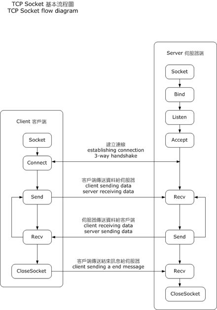

# CHEAT SHEET

Victoria Mengqi LIU

## Socket API functions

+ `socket()` creates a new socket of a certain socket type, identified by an integer number, and allocates system resources to it.

+ `bind()` is typically used on the server side, and associates a socket with socket address structure, i.e. a specified local port number and IP address.

+ `listen()` is used on the server side, and causes a bound TCP socket to enter listening state.

+ `connect()` is used on the  client side, and assigns a free local port number to a socket. In case of a TCP socket, it causes an attempt to establish a new TCP connection.

+ `accept()` is used on the server side. It accepts a received incoming attempt to create a TCP connection from the remote client, and creates a new socket associated with the socket address pair of this connection.

+ `send()`  and `recv()`, or `write()` and `read()`, or `sendto()` and `recvfrom()`, are used for sending and recving data to/from a remote socket.

+ `close()` causes the system to release resources allocated to a socket. In case of TCP, the connection is terminated.

+ `gethostbyname()` and `gethostbyaddr()` are used to resolve host names and addresses. IPv4 only.

+ `select()` is used to pend, waiting for one or more of a provided list of sockets to be ready to read, ready to write, or that have errors.

+ `poll()` is used to check on the state of a socket in a set of sockets. The set can be tested to see if any socket can be written to, read from or if an error occurred.

+ `getsockopt()` is used to retrieve the current value of a particular socket option of the specified socket.

+ `setsockopt()` is used to set a paticular socket option for the specified socket.

#### Socket

=======

	int socket(int domain, int type, int protocol);
 
> `domain`

> + `AF_INET` IPv4
> + `AF_INET6` IPv6
> + `AF_UNIX` local socket

> `type`

> + `SOCK_STREAM` 
> + `SOCK_DGRAM`
> + `SOCK_SEQPACKET`
> + `SOCK_RAW`

> `protocol`

> + `IPPROTO_TCP`
> + `IPPROTO_SCTP`
> + `IPPROTO_UDP`
> + `IPPROTO_DCCP`

> ###### RETURN
> `? newly assigned descriptor : -1`

=======

	int bind(int sockfd,
		const struct sockaddr *my_addr, socklen_t addrlen);

> ###### RETURN
> `? 0 : -1`

=======

	int connect(int sockfd,
		const struct sockaddr *serv_addr, socklen_t addrlen);
				
> **connection-oriented** protocol

> establishes a connection

> **connectionless** protocol

> defines the remote address for sending & receiving data. In these cases, the `connect` function prevents reception of datagrams from other sources.

> ###### RETURN
> `? 0 : -1`

=======

	struct hostent *gethostbyname(const char *name);

	struct hostent *gethostbyaddr(const void *addr, int len, int type);

> `addr` pointer to `struct in_addr`

> ###### RETURN
> `? struct hostent * : NULL`

=======

#### UDP

=======

	int 
	recvfrom(int sockfd, 
		void *buf, int len, 
		unsigned int flags, 
		struct sockaddr *from, int *fromlen); 

=======
	
	int 
	sendto(int sockfd, 
		const void *msg, int len, 
		unsigned int flags,
           	const struct sockaddr *to, socklen_t tolen);

=======

#### TCP

=======

	int listen(int sockfd, int backlog);

> only necessary for `SOCK_STREAM` `SOCK_SEQPACKET`

> ###### RETURN
> `? 0 : -1`

=======
 
 	int accept(int sockfd,
 		struct sockaddr *cliaddr, socklen_t *addrlen);

> `addrlen` when `accept()` returns, this location indicates how many bytes of the structure were actually used.

> ###### RETURN
> `? new socket descriptor : -1`

=======

#### FILE

=======

	char *
	fgets(char *s, int size, FILE * stream);   
	
=======