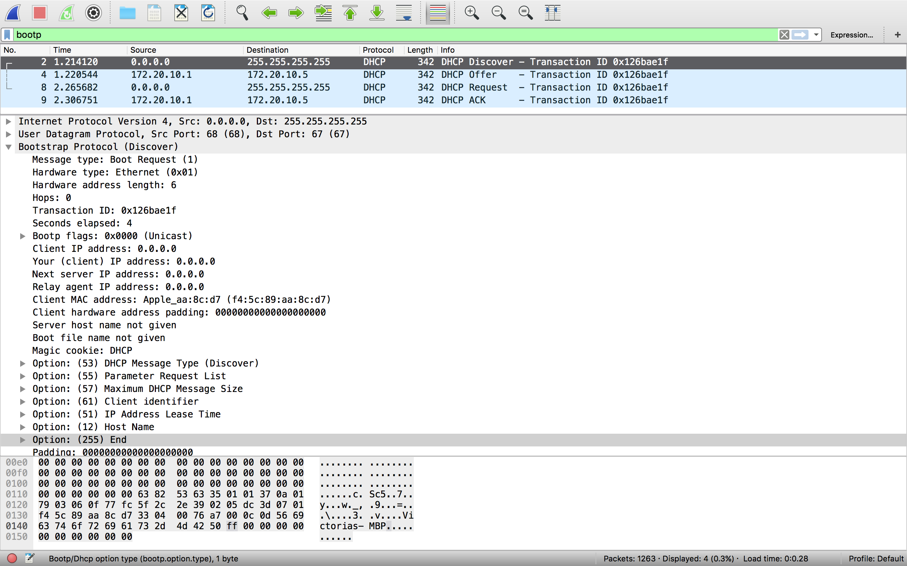

# Using Wireshark to capture DHCP & DNS message

> **Author: Victoria Mengqi LIU**
	**刘梦琪**

> **ClassID: 2013215105**

> **StudentID: 2013213062**

## 1. Configuration of Wireshark

Before we make the lab, there are several steps to take before starting the capture procedure. The system of my computer is window & old version of Wireshark.
Firstly, install the Wireshark. Because I can’t login the `https://www.wireshark.org/download.html` so I install another vision.In the menu, select **Capture-Interfaces**, selects the interface, then select **Options**.

## 2. Procedure of capture

### For DHCP

1. Select the **Option** for the capturing, input the Capture Filter condition “udp port 67”, then press “Start”.
2. Open CLI, input `ipconfig /release` to release the address.
3. Input `ipconfig /renew` in CLI.

### For DNS

1. Select the **Options** for the capturing, input the Capture Filter condition `udp port 53`, then press **Start**
2. Input `nslookup -qt=A/MX bupt.edu.cn` in CLI

## 3. For DHCP Capture

### List the value

#### Discover

After the client cancels the remaining lease of the IP address with DHCP server,it has no IP address.Then the IP address acquisition process begins.
First DHCP client sends out the discover message to discover all DHCP servers in local area or other subnets(if relay agent is used).

By selecting the DHCP Discover message,the detailed information of the message is shown in the packet details pane.The following figure shows the detailed information:

	Bootstrap Protocol (Discover)
	Message type: Boot Request (1)
	Transaction ID: 0x126bae1f
	Client IP address: 0.0.0.0
	Your (client) IP address: 0.0.0.0
	Next server IP address: 0.0.0.0
	Relay agent IP address: 0.0.0.0
	Option: (53) DHCP Message Type (Discover)
	Option: (55) Parameter Request List
	Option: (57) Maximum DHCP Message Size
	Option: (61) Client identifier
	Option: (51) IP Address Lease Time
	Option: (12) Host Name
	Option: (255) End
	Frame address: 
		Source: 0.0.0.0	
		Destination: 255.255.255.255

#### Offer

After DHCP servers receive discover message from a client,they will send back an offer message to offer the client an available IP address from the address pool or simply offer the requested IP address in the discover message.
The following 2 figures below show the detailed information in the heading of DHCP Offer Message:

	Bootstrap Protocol (Offer)
	Message type: Boot Reply (2)	
	Transaction ID: 0x126bae1f
	Client IP address: 0.0.0.0
	Your (client) IP address: 172.20.10.5
	Next server IP address: 172.20.10.1
	Relay agent IP address: 0.0.0.0
	Option: (53) DHCP Message Type (Offer)
	Option: (54) DHCP Server Identifier
	Option: (51) IP Address Lease Time
	Option: (1) Subnet Mask
	Option: (3) Router
	Option: (6) Domain Name Server
	Option: (255) End
	Frame address: 
		Source: 172.20.10.1	
		Destination: 172.20.10.5

#### Request

After the client receives offers from different DHCP servers,it selects one offer by sending request message to the selected server and at the same time to decline other servers’ offers.In this lab,since only one server gives offer to the client,there’s no selection process.

	Bootstrap Protocol (Request)
	Message type: Boot Request (1)
	Client IP address: 0.0.0.0
	Your (client) IP address: 0.0.0.0
	Next server IP address: 0.0.0.0
	Relay agent IP address: 0.0.0.0
	Option: (53) DHCP Message Type (Request)
	Option: (55) Parameter Request List
	Option: (57) Maximum DHCP Message Size
	Option: (61) Client identifier
	Option: (50) Requested IP Address
	Option: (54) DHCP Server Identifier
	Option: (12) Host Name
	Option: (255) End
	Frame address: 
		Source: 0.0.0.0	
		Destination: 255.255.255.255

#### ACK

After the selected server receives the request message from the client,it sends out an **ACK** message to acknowledge that the offered IP address is assigned to the client.

	Bootstrap Protocol (ACK)
	Message type: Boot Reply (2)
	Transaction ID: 0x126bae1f
	Client IP address: 0.0.0.0
	Your (client) IP address: 172.20.10.5
	Next server IP address: 172.20.10.1
	Relay agent IP address: 0.0.0.0
	Option: (53) DHCP Message Type (ACK)
	Option: (54) DHCP Server Identifier
	Option: (51) IP Address Lease Time
	Option: (1) Subnet Mask
	Option: (3) Router
	Option: (6) Domain Name Server
	Option: (255) End
	Frame address: 
		Source: 172.20.10.1	
		Destination: 172.20.10.5

### Explain for the Parameters

We can find that the message type may be different because thesetwo values have different meanings, which type  ‘1’ means boot request from client to server and  ‘2’ means boot reply from server to client.

Next, we may find that IP address which the client has may be changed. Thismeans that when laptop sends DHCP REQUEST source destination must be set all 0s
in the packet header, which here all 0s means communicate from client to the serverneed not to through the router.

	Option:(1) Subnet Mask
	Option:(3) Router
	Option:(6) Domain Name Server
	Option:(12) Host name
	Option:(50) Request IP address
	Option:(51) IP address lease time
	Option:(53) DCHP Message Type
	Option:(54) DCHP Server Identifier
	Option:(55) Parameter Request List

Frame Addres: i.e. MAC address

### Compared with the example

###### Tabel 1: DHCP-discover comparison
|parameter|example|Capture|
|------|-------|-------|
|Transaction ID|12|0x126bae1f|
|Your IP Address|12|0.0.0.0|
|Destination IP|255.255.255.255|255.255.255.255|

###### Tabel 2: DHCP-offer comparison
|parameter|example|Capture|
|------|-------|-------|
|Transaction ID|12|0x126bae1f|
|Your IP Address|192.168.10.98|172.20.10.1|
|Destination IP|255.255.255.255|172.20.10.5|

###### Table 3: DHCP-request comparson
|parameter|example|Capture|
|------|-------|-------|
|Transaction ID|12|0x126bae1f|
|Your IP Address|192.168.10.97|0.0.0.0|

###### Table 4: DHCP-ACK comparison
|parameter|example|Capture|
|------|-------|-------|
|Transaction ID|12|0x126bae1f|
|Your IP Address|192.168.10.98|172.20.10.5|

### MSC

## 4. For DNS Capture

Including DNS QUERY and DNS Query RESPONSE. Analyze the captured packets in*field-level* and explain the meaning and result of each field value. Capture your screen and show the result.

List the command with shell, enter the `nslookup –qt=A bupt.edu.cn`

This command is used to query the system

List the command with shell, enter the `nslookup –qt=MX bupt.edu.cn`

#### DNS Standard Query Packet (`nslookup type=A`)

By selecting the DNS Standard Query message,detailed information of this packet’s is shown in the figure below:

###### Detailed information in DNS Query Packet (`nslookup type=A`)

> The form below lists the values of fields and corresponding explanations:
> 
> Transaction ID=0x16fc This field is used to match queries and corresponding responses.Here,the transaction ID of this DNS query packet is 0x16fc. The response packet to this query should have the same transaction ID.
> 
> Queries Name= `bupt.edu.cn` The first field of the question section.
> 
> `Opcode=0000` A field used to specify the domain name which is used to do the query. Here, “0000” indicates thatthis query is a standardquery which is used to map adomain name to its IP address. A 4-bit field which describes the type of a query. Here, “0000” indicates thatthis query is a standardquery which is used to map adomain name to its IP address.

#### DNS Standard Response Packet (`nslookup type=A`)

By selecting the DNS Standard Query message,detailed information of this packet’s is shown in the figure below:

###### Detailed information in DNS Response Packet (nslookup type=A)

lists the values of fields and corresponding explanations:

`Transaction ID=0x16fc` This field is used to match queries and corresponding responses. Here,the transaction ID of this DNS response packet is 0x16fc. The response packet to this query should have the same transaction ID with query packet.

`Query type=A`  The second field of the question section.A 16-bit field is used tospecify the type of the query.  Asking for a resource record with a particular type Here, “A” indicates this query asks for the host IP address for the given domain name. 

`Resource Record 1 (Primary name server)= ns.buptnet.edu.cn`
This field defines the Primary name server in the resource data in bytes.
In this resource record, the record shows that primary name server is `ns.buptnet.edu.cn`

#### DNS Standard Query Packet (`nslookup type=MX`)

By selecting the DNS Standard Query message,detailed information of this packet’s is shown in the figure below:

###### Detailed information in DNS Query Packet (`nslookup type=MX`)

Lists the values of fields and corresponding explanations:

`Transaction ID=0xc1f9` This field is used to match queries and corresponding responses. Here,the transaction ID of this DNS query packet is 0xc1f9. The response packet to this query should have the same transaction ID.

`Queries Name= bupt.edu.cn` The first field of the question section.

A field used to specify the domain name which is used to do the query.

#### DNS Standard Response Packet (`nslookup type=MX)

By selecting the DNS Standard Query message,detailed information of this packet’s is shown in the figure below:

###### Detailed infomation in DNS Response Packet (`nklookup type=MX`)

lists the values of fields and corresponding explanations:

`Transaction ID=0xc1f9` This field is used to match queries and corresponding responses. Here,the transaction ID of this DNS response packet is 0xc1f9. The response packet to this query should have the same transaction ID with query packet.

`Query type=MX`  The second field of the question section.MX 16-bit field is used to specify the type of the query.  Asking for a resource record with a particular type Here, “MX” indicates this query asks for the host IP address for the give server of the email server.

`Resource Record 1 Mail exchange)= mx1.bupt.edu.cn`

This field defines the Mail exchange. In this resource record, the record shows that mx1.bupt.edu.cn is mail exchange

#### Comparisons of DNS Examples in Lecture notes.

lecture notes,the “Z” field in the DNS message should be a 3-bit field which is reserved for future use and must be set to 0.However,in the caputred packet,only the first bit is identified as “Z” field.The remaining two bits are used to indicate the answer’s authentication and data’s authentication. 
